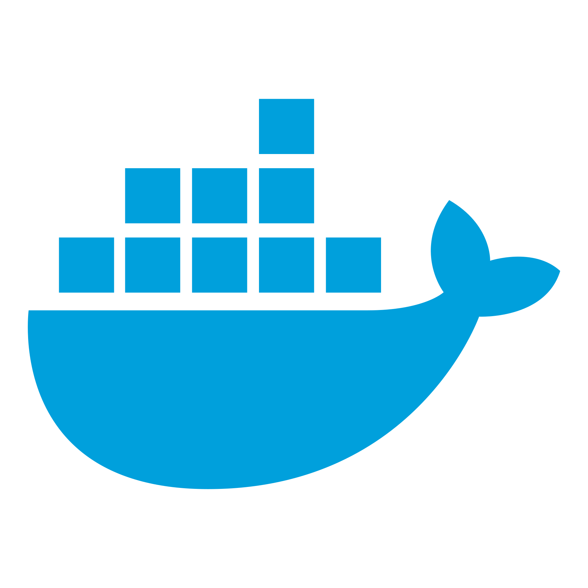
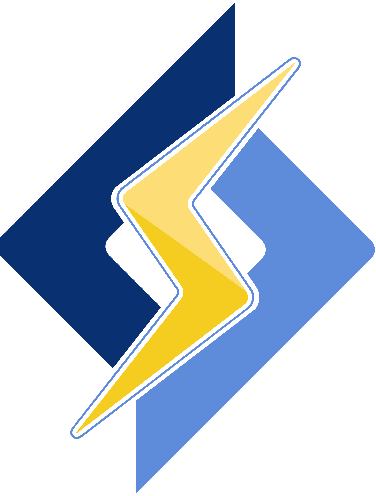
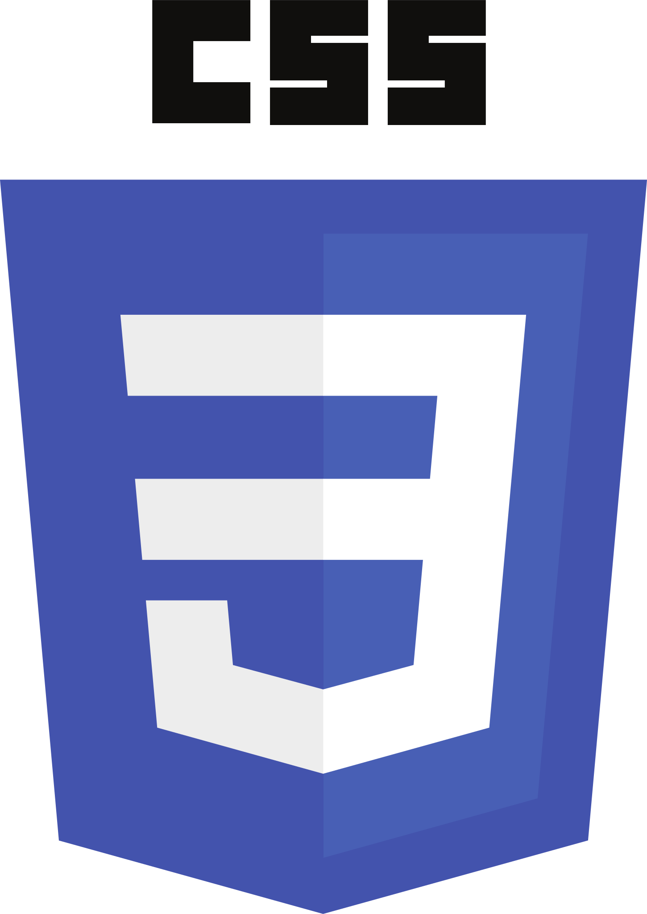

<head>
    <link href="https://fonts.googleapis.com/css2?family=Cairo:wght@200..1000&family=Playwrite+NG+Modern:wght@100..400&family=Roboto:ital,wght@0,400;0,700;0,900;1,400&family=Tajawal:wght@200;300;400;500;700;800;900&display=swap" rel="stylesheet">
</head>

<h1 align="center" style="font-family: 'Playwrite NG Modern', cursive;">Hi 👋, I'm 
Kareem Adel

</h1>
<h3 align="center">A passionate frontend developer from Egypt, </h3>

- 🔭 I’m currently working on a Very Secret Project 🤫

- 🌱 I’m currently learning **Mastering React & Next.js**

- 📫 How to reach me **contact@kareem-adel.com**

<h3 align="left">Connect with me:</h3>

<h3 align="left">Languages and Tools:</h3>

&nbsp; &nbsp; &nbsp; &nbsp;

&nbsp; &nbsp; &nbsp; &nbsp;

